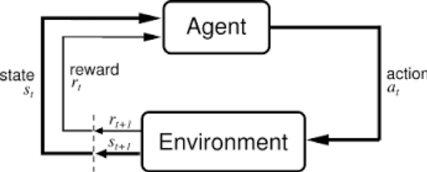
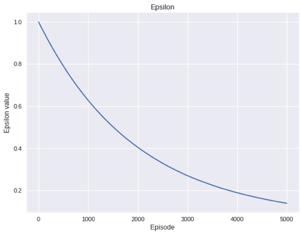
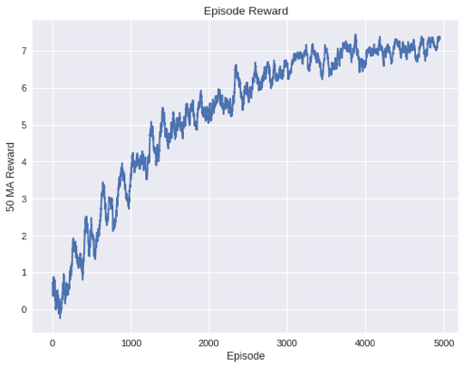
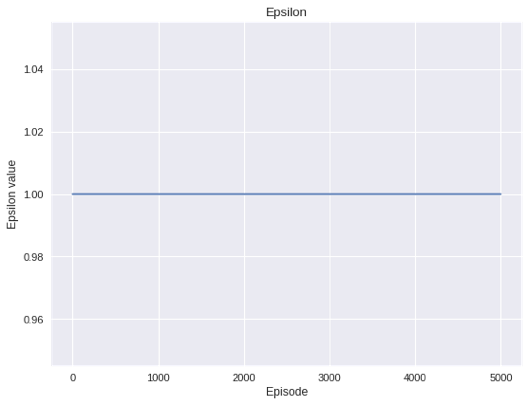
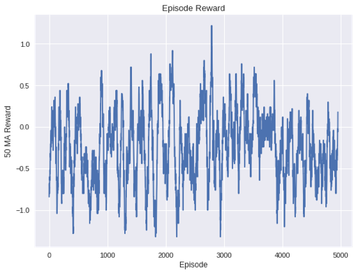
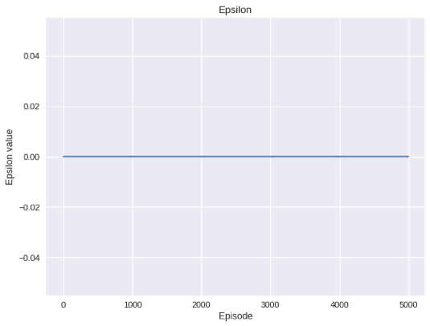
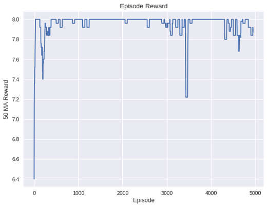
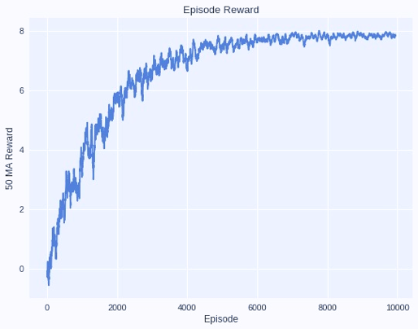
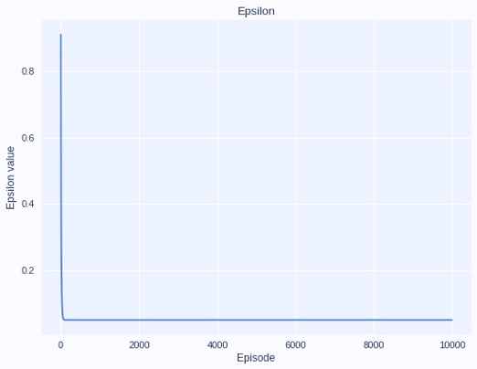

# Tom-Jerry-using-Reinforcement-Learning

Reinforcement Learning can be referred to as goal-based algorithms which involve an environment, an agent & a predefined goal. The main aim of such algorithms is to allow the agent to explore the environment. This exploration task is essential for the agent in order to learn & device various paths towards the goal.
Reinforcement Learning is being used heavily in today’s real-world applications. One such successful example of application of Reinforcement Learning is DeepMind’s AlphaGo algorithm that was able to beat world’s top Go player using Reinforcement Learning. 
In order to understand the working of Reinforcement Learning, lets take a look at following diagram,

 

 
Based on the diagram above, ‘t’ & ‘t+1’ denotes the time steps, each referring to current & next states respectively. The variables st , at and rt denote the current state, action performed and the reward obtained by the agent respectively. 
Environments are functions that respond to an Action taken in current state by providing a response in terms of Reward to the Agent. On the other hand, Agents are functions that take in the new state & reward as the input and convert to an appropriate action. Unlike other types of Machine Learning, such as Supervised Learning; Reinforcement Learning does not require huge amounts of training data to train on & can only to thought about in terms of state- action pairs that occur one after the other

## Implementing Deep Reinforcement Learning
### Introduction
Deep Reinforcement Learning can be defined as a modified method of implementing Reinforcement Learning by combining the independent nature of Reinforcement Learning with the efficiency of Deep Learning. 
Neural Networks can be added as an agent that learns to environment state-action pairs to rewards. Neural Network now works as a function approximator to relate the input values to the outputs. Generally, in order for the Neural Network to train, we allow the Network itself to fill the Q table based on its prior experiences inside the environment and then ask it to learn various paths towards the goal, based on these values.

### Implementation

**A. Environment** 
The Environment is the work area that is used by the Agent to learn from and reach its goal state. Here, we have designed our Environment to be structured like OpenAI’s Gym Environments. The Environment is 5x5 grid-world that has no obstacles, but just the Agent and the goal. Our Environment works as a function that provides the Agent specific reward to the agent based the actions it performs to reach the goal.

**B. Memory** 
The Memory was implemented in order to store Agents experiences with the Environment. These experiences are added to the Memory in order for the Q table to be built from it. The Agent can then access the Q table to learn which action is the best for the next state. Here we store the experience in the [s, a, r, s_] format, where s = current state, a = current action, r = current reward and s_= next state 

**C. Brain** 
Brain can be described as a three-layer Neural Network model with two hidden layers. The main function of the Brain is to learn from the prior experiences, relate new inputs to new outputs and store all the new experiences inside the Memory for future usage. The Neural Network Model is structured as follows:
LINEAR -> RELU -> LINEAR -> RELU -> LINEAR.
Hence, the activation function for first & second hidden layers is ‘RELU’ and rest of the layers have ‘LINEAR’ activation. Each node in the hidden layer contains 128 nodes and number of output nodes is the same as the size of the action space (LEFT, RIGHT, UP, DOWN)

**D. Agent** 
The Agent in the entity function in the Environment that learns to navigate its way towards the goal based on prior experiences. Here, our Agent is ‘Tom’ the cat, whose entire task to find a path towards its goal i.e. ‘Jerry’ the mouse.
The Agent includes implementation of the Epsilon Greedy Algorithm and the Bellman Optimality Equation used to generate Q values and in turn fill the Q table. The Agent uses the Brain to process the inputs provided from its interaction with the Environment and stores it into the Q table using the Memory and Q function. 
Subsequently, as the Agent performs more & more Exploration, the Epsilon value starts to decay and it becomes more confident about its Environment. This leads to the start of Exploitation, where in the Agent tries to find new paths towards its goal by selecting the best action possible in every state.

**E. Algorithm** 
Lastly, the Algorithm is the final part of the program that works as a initiator of all the various components of the program. Algorithm is responsible to calculate number of episodes, time taken and the mean rolling reward after a set number of episodes are completed. It is also responsible for coordination between all the components of the program such as the Brain, Agent, Environment & Memory. It is used to run all the components of the program in a desired order to pass the output of one component to another and also to generate the final output necessary to terminate the program. 
A normal running of each cycle of the algorithm includes resetting the Environment function at the beginning, pass its reward return value to the Agent function. Now the Agent returns a value in terms of action which is passed to the Environment, which is again responded by the Environment by a new reward. This cycle continues until the episode is completed, when we get the final reward. The algorithm then saves the final observed tuple to the Memory and then the cycle again starts from resetting the Environment. 

### Observations
* The agent was able to reach its goal and learn various paths towards the goal in around 550.51 seconds.
* The final mean rolling reward for the last set of episodes was 5.1857
* The final Epsilon value after decay was 0.1417. Following graph demonstrates how the Epsilon value decays throughout the exploration and exploitation periods of the agent,
 

 

 
* Total number of episodes run is 5000
* Based on the graph demonstrated below, the Agent stops exploring and starts exploiting the Environment at completion of around 4000 episodes when the reward values do not increase rapidly and are remain constant through the next 1000 episodes. 
 

 

 
### Hyperparameter Tuning & Results

In order to understand the concepts of Reinforcement Learning and how the agent reacts to various Hyperparameter values, I have tried to perform following variations:

**A. Epsilon** 
Epsilon can be defined as the probability of taking random action based on the values for a particular state from the Q table.

* **Case 1:** When Epsilon is set to 1 
When the value of Epsilon is set to a constant maximum value of 1, the agent will continuously start to explore the environment. But as the value of Epsilon does not decrease it will never start exploitation of the environment. The result of this is seen in the graph that represents the rewards obtained by the agent. As the agent keeps on exploring the environment, the graph for rewards has a lot of variations.
 

 

 

 

 
 
* **Case 2:** When Epsilon is set to 0 
When the value of Epsilon is set to a constant minimum value of 0, the agent will never explore the environment, but will directly start to exploit its way towards the goal. Hence as the value of Epsilon does not increase more than zero, the agent will always follow one path towards the goal and will never learn to find new paths in the environment. The result of this is seen in the graph that represents the rewards obtained by the agent. As the agent already starts with exploiting its way towards the goal, the graph shows a sudden increase in the reward value and after that as the agent follows on a single path, the reward will always be the same maximum value for a single path.
 

 

 

 

 
 
Hence, after multiple variations in the Epsilon value, the optimal value in range from 1 to 0 

**B. Gamma** 
Gamma, also denoted as the discounting factor, the penalty applied to the rewards in the future. The future rewards have high uncertainty and hence it is important that the agent does not consider such rewards of similar importance as the current rewards. This is based on the concept that as future rewards do not provide immediate benefits, the agent should not give it that much importance. 

* **Case:** When Gamma is set to 0 
When the value of Gamma is set to 0, the discounting factor affecting the future rewards will be set to zero. Hence, the values of the Q table will be affected greatly not only by the current rewards but also by all the future rewards. The result of this is clearly shown in the graph as when all the rewards affect the decision taken by the model, the variations in the graph are reduced to a bare minimum once the reward reaches a certain high value. 

 

 

 

Hence, after multiple variations in the Gamma value, the optimal starting value is 0.99

**C. Lambda** 
Lambda, also described as the Delay Rate, can be described as the rate at which the Epsilon value will be reduced from 1 to 0. The value for Lambda is extremely important as it helps in deciding when then model will stop exploration & start its exploitation over the environment. 

* **Case:** When the Lambda value is set to 0.01 
When the value of Lambda is set to a large value of 0.01, we observed that the value of Epsilon falls sharply. This indicates that as Lambda is considered as the Decay Rate, when it is set to a large number, the Epsilon decays really fast resulting in making the model stop exploring new paths & start exploiting a path towards the goal. This may lead the agent to be biased to a single method or path of reaching the goal as the agent has not explored i.e. is not aware of all the other paths towards the goal. This fact becomes evident in the graph demonstrated below.

 

 
Hence, after multiple variations in the Lambda value, the optimal starting value is 0.001
